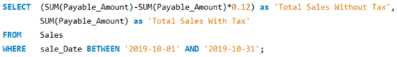
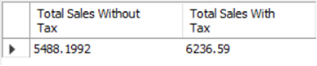
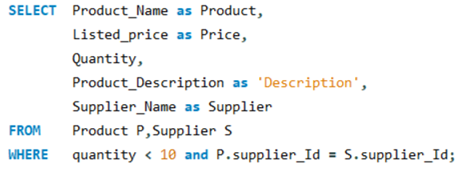
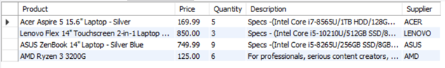
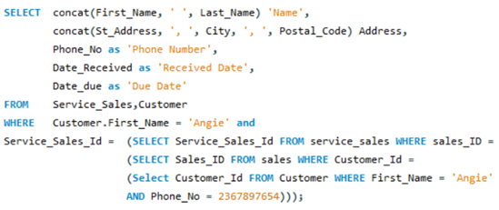
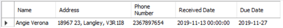
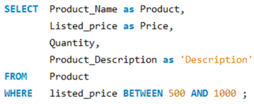
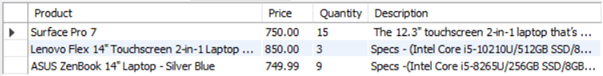
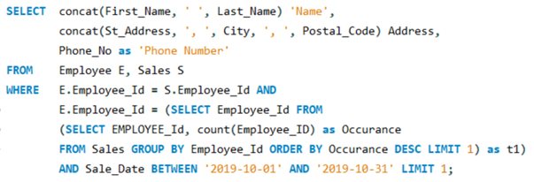

**Queries**

**Some examples of queries as follow:** 
 

1.  **Monthly Sales:** 

a.  Purpose: 

> Suppose the shop owner wants to know the total monthly sales of the
> month October with tax as well as without tax. The following query
> will help the owner to know the sales' stats. 

b.  Syntax: 

> 

c:  Meaning of the results: 

> The result will show the total sales that have been occurred for the
> specified month with tax and without tax. 
>
> Example: 
>
> 

2.  **Inventory Check:** 

a.  Purpose: 

> The following query will help the employees to do an inventory
> check i.e to check if all the product at the store are available in a
> required quantity. 

b.  Syntax: 

> 

c: Meaning of the results: 

> The result of this query shows a table that contains the
> products whose quantity is less than 10 items. It also shows
> the Supplier name of those products respectably as well.   
>
> Example: 
> 

3.  **Checking Due Date of repairs:** 

a.  Purpose: 

> This query helps the employees to know the due date of repair given a
> customer name and their phone number. 

b.  Syntax:

> 

c: Meaning of the results: 

> The result will show a table with a row containing customer
> information along with the date received and due date of
> the repair request by respectable customer. 
>
> Example: 
> 

4.  **Product Lookup:** 

a. Purpose:  

> The following query shows the products that satisfy the customer
> budget constraints. 

b. Syntax: 
> 

c: Meaning of the results: 

> The result will list the products from the product table those
> fall within certain range of price as requested by the customer 
>
> Example: 
> 

5.  **Employee of the month:** 

a.  Purpose: 

> The purpose of the following query is to help the shop owner know
> who their best employee for a particular month is. 
>
> The employee who is engaged in maximum number of sales is selected as
> the employee of the month.

  
b. Syntax: 

> 

c: Meaning of the results: 

> The query will show the personal details of that employee who
> has achieved maximum number of sales for a specific month. 
>
> Example: 
> 
